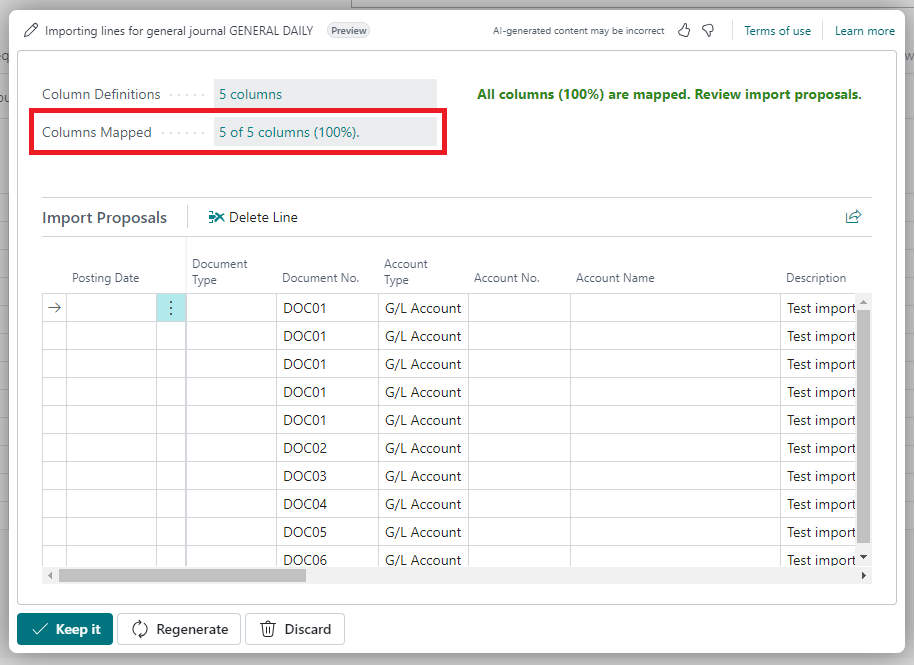

# Regenerate response
&nbsp;  

You can modify the column mapping before finalizing the proposed import. Simply click **Columns Mapped**, choose a different destination field, and then click **Regenerate**. A new proposal will be generated based on your updated selection.
&nbsp;  

&nbsp;  

